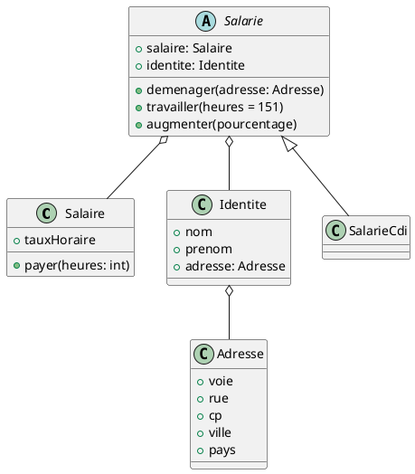

# Application de gestion de salariés👩‍💼🧑‍💼

---
Diagramme de classe :

--- 
## Pour exécuter les tests 🧪 :
1. *clic droit* sur le package `test/java/exercices/tp2`
2. *clic gauche* sur le bouton "▶️ Run Tests in Tp2"

*Les getters et les setters ne sont pas testés*